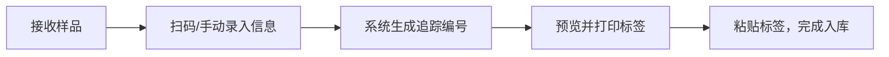
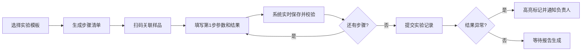

## 1. 产品概述
本系统是面向实验室的样品和实验流程全生命周期追踪管理平台，解决实验室样品流转混乱、实验数据记录不规范、报告生成效率低等核心问题。通过扫码追踪、流程标准化、数据实时保存等功能，实现样品从接收到报告出具的全程可追溯、可监控。

主要面向：实验室管理人员、实验操作人员、项目负责人、委托方客户。
核心价值：提升实验室运营效率30%以上，降低数据丢失风险，确保实验流程标准化合规。

## 2. 核心功能

### 2.1 用户角色
| 角色 | 注册方式 | 核心权限 |
|------|----------|----------|
| 实验室管理员 | 系统创建 | 全权限管理、模板配置、用户管理、报告审批 |
| 实验操作人员 | 系统创建 | 样品录入、流转操作、实验记录填写、模板使用 |
| 项目负责人 | 系统创建 | 项目查看、异常处理、报告审核、通知接收 |
| 委托方客户 | 邀请注册 | 报告查看、样品进度查询 |

### 2.2 功能模块
1. **仪表盘**：数据概览、样品状态统计、待办事项、异常提醒
2. **样品管理**：扫码录入、信息登记、追踪编号生成、标签打印、样品查询
3. **流转追踪**：状态更新、负责人分配、流转历史、实时位置查询
4. **实验记录**：操作参数记录、仪器编号、观测结果、实时保存、数据回溯
5. **流程模板**：模板创建编辑、步骤管理、参考范围设置、模板复用
6. **报告管理**：草稿自动生成、在线编辑、PDF导出、电子签章、报告分享
7. **异常管理**：结果高亮、自动通知、异常处理记录

### 2.3 页面详情
| 页面名称 | 模块名称 | 功能描述 |
|---------|----------|----------|
| 仪表盘 | 数据概览 | 统计卡片展示样品总数、进行中、已完成、异常数量；趋势图表；待办任务列表 |
| 仪表盘 | 异常提醒 | 实时展示超出参考范围的异常结果，点击跳转详情 |
| 样品录入 | 信息登记表单 | 样品名称、类型、来源、委托方、接收日期、数量、描述等字段 |
| 样品录入 | 扫码识别 | 支持扫码枪输入样品条码，自动填充关联信息 |
| 样品录入 | 追踪号生成 | 系统自动生成唯一追踪编号（格式：LAB-YYYYMMDD-XXXX） |
| 样品录入 | 标签打印 | 预览并打印样品标签，含二维码、追踪号、样品名称 |
| 样品列表 | 数据表格 | 展示所有样品，支持筛选、搜索、排序 |
| 样品列表 | 状态追踪 | 点击样品查看当前所在环节和完整流转历史 |
| 流转操作 | 扫码更新 | 扫描样品追踪码，选择目标环节，填写备注，更新负责人 |
| 流转操作 | 环节可视化 | 流程图展示样品在各环节的流转状态和时间节点 |
| 实验记录 | 步骤清单 | 根据模板生成的实验步骤，逐项打勾确认完成 |
| 实验记录 | 参数录入 | 操作参数、仪器编号、环境条件、观测结果输入，实时保存 |
| 实验记录 | 异常标记 | 结果超出参考范围时自动高亮标记，输入异常说明 |
| 模板管理 | 模板列表 | 展示所有实验流程模板，支持增删改查 |
| 模板管理 | 模板编辑器 | 拖拽排序实验步骤，设置参考范围、必填项、仪器要求 |
| 报告管理 | 草稿列表 | 自动生成的报告草稿，支持编辑、预览 |
| 报告管理 | 报告编辑器 | 富文本编辑，支持插入图片、表格、签名 |
| 报告管理 | PDF生成 | 一键生成标准格式PDF报告，支持电子签章 |
| 报告管理 | 分享功能 | 生成分享链接或直接发送邮件给委托方 |
| 异常中心 | 异常列表 | 所有异常结果汇总，按严重程度排序 |
| 异常中心 | 通知记录 | 展示异常通知发送记录和处理状态 |

## 3. 核心流程

### 3.1 样品录入流程
实验室接收样品 → 扫描样品原有条码 → 填写样品基本信息和来源 → 系统生成唯一追踪编号 → 打印标签并粘贴 → 样品入库待检

### 3.2 实验执行流程
选择实验流程模板 → 生成标准化步骤清单 → 扫描样品开始实验 → 逐项填写操作参数、仪器编号、观测结果 → 系统自动校验结果是否异常 → 完成所有步骤后提交

### 3.3 报告生成流程
实验完成 → 系统自动生成报告草稿 → 操作人员编辑确认 → 负责人审核 → 生成正式PDF并盖电子章 → 分享给委托方

## 4. 用户界面设计

### 4.1 设计风格
- **主色调**：深蓝色 (#165DFF) - 代表专业、可信赖，符合实验室严谨的工作氛围
- **辅助色**：绿色 (#00B42A) 表示正常/完成，红色 (#F53F3F) 表示异常/警告，橙色 (#FF7D00) 表示进行中
- **中性色**：白色背景、深灰 (#1D2129) 文字、浅灰 (#F2F3F5) 分区背景
- **按钮风格**：圆角4px，扁平化设计，主按钮使用蓝色填充，次要按钮使用描边
- **字体**：使用思源黑体（Source Han Sans）作为主要字体，标题字重600，正文400
- **布局风格**：左侧固定导航栏 + 右侧内容区，卡片式模块化布局，数据表格为主
- **图标风格**：线性简约图标，统一线宽2px，圆角2px

### 4.2 页面设计概述
| 页面名称 | 模块名称 | UI元素 |
|---------|----------|--------|
| 仪表盘 | 数据概览 | 4张彩色统计卡片横向排列，下方折线图展示趋势，右侧待办列表和异常提醒 |
| 样品录入 | 表单区 | 多步骤表单向导，步骤指示器在顶部，表单字段两列布局，扫码输入框带扫描图标 |
| 样品录入 | 标签预览 | 右侧实时预览标签样式，二维码动态生成，打印按钮醒目 |
| 样品列表 | 数据表格 | 支持列宽调整、固定表头、行悬停高亮、状态标签彩色显示 |
| 流转操作 | 流程图 | 垂直时间线布局，每个节点带状态图标和时间，当前环节高亮 |
| 实验记录 | 步骤清单 | 左侧步骤导航，右侧参数表单，已完成步骤带绿色对勾，当前步骤蓝色边框 |
| 实验记录 | 实时保存 | 右上角显示"已自动保存"状态提示，带时间戳 |
| 模板管理 | 模板卡片 | 网格布局展示模板，卡片含模板名称、步骤数、使用次数、操作按钮 |
| 模板管理 | 编辑器 | 拖拽排序，每步可展开编辑详细配置，参考范围用区间输入组件 |
| 报告管理 | 预览区 | 模拟A4纸张效果，页边距清晰，工具栏支持格式设置和签章 |
| 异常中心 | 异常列表 | 每行异常结果红色背景高亮，异常等级用不同颜色圆点标记 |

### 4.3 响应式设计
- **桌面端优先**：针对实验室工作场景，主要在桌面端使用，优化大屏展示
- **平板适配**：支持1024px以上平板设备，导航栏可折叠
- **移动端**：768px以下简化布局，表格横向滚动，底部导航代替侧边栏
- **触摸优化**：按钮最小尺寸44x44px，表单输入框加大，支持扫码调用摄像头

### 4.4 动效设计
- **页面加载**：骨架屏占位，内容渐入，避免布局跳动
- **状态切换**：状态标签切换时缩放+淡入动画，流畅自然
- **表单交互**：输入框聚焦时轻微放大，边框变色，错误提示抖动反馈
- **步骤完成**：打勾确认时触发轻微的成功动效，对勾图标弹性动画
- **异常通知**：右上角滑入通知横幅，红色背景闪烁3次引起注意
- **数据更新**：表格行数据变化时背景色短暂高亮，提示用户
