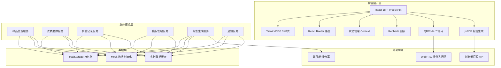
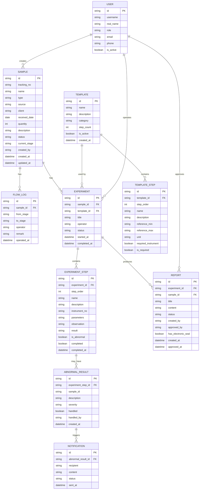

## 1. 架构设计



## 2. 技术描述

- **前端框架**：React@18.2.0 + TypeScript@5.0
- **构建工具**：Vite@5.0
- **样式方案**：TailwindCSS@3.4 + PostCSS
- **路由管理**：React Router DOM@6.20
- **图表组件**：Recharts@2.10
- **二维码生成**：qrcode.react@3.1
- **PDF生成**：jspdf@2.5 + html2canvas@1.4
- **图标库**：Lucide React@0.294
- **富文本编辑**：简单自定义编辑器（避免引入重型依赖）
- **数据存储**：localStorage + 内存状态管理
- **数据持久化**：所有业务数据自动保存到localStorage
- **初始化工具**：vite-init 脚手架

## 3. 路由定义

| 路由路径 | 页面名称 | 功能说明 |
|----------|---------|----------|
| / | 仪表盘 | 数据概览、统计图表、待办事项、异常提醒 |
| /samples | 样品列表 | 所有样品列表展示、筛选、搜索 |
| /samples/new | 样品录入 | 扫码录入、信息登记、标签打印 |
| /samples/:id | 样品详情 | 样品信息、流转历史、实验记录查看 |
| /flow | 流转操作 | 扫码更新状态、环节可视化 |
| /experiments | 实验记录列表 | 所有实验记录列表查看 |
| /experiments/new | 新建实验 | 选择模板、扫码关联样品、填写记录 |
| /experiments/:id | 实验详情 | 实验记录详情查看、编辑 |
| /templates | 模板列表 | 实验流程模板列表管理 |
| /templates/new | 新建模板 | 创建新的实验流程模板 |
| /templates/:id/edit | 编辑模板 | 编辑已有模板配置 |
| /reports | 报告列表 | 所有报告草稿和正式报告 |
| /reports/:id | 报告编辑 | 编辑报告、生成PDF、签章分享 |
| /exceptions | 异常中心 | 异常结果列表、通知记录 |

## 4. 数据模型

### 4.1 实体关系图



### 4.2 核心数据类型定义

```typescript
// 样品状态枚举
type SampleStatus = 'pending' | 'testing' | 'completed' | 'abnormal' | 'archived';

// 实验环节枚举
type ExperimentStage = 'received' | 'preparation' | 'testing' | 'analysis' | 'review' | 'completed';

// 用户角色枚举
type UserRole = 'admin' | 'operator' | 'manager' | 'client';

// 异常严重程度
type SeverityLevel = 'low' | 'medium' | 'high' | 'critical';

interface Sample {
  id: string;
  trackingNo: string;
  name: string;
  type: string;
  source: string;
  client: string;
  receivedDate: string;
  quantity: number;
  description: string;
  status: SampleStatus;
  currentStage: ExperimentStage;
  createdBy: string;
  createdAt: string;
  updatedAt: string;
}

interface FlowLog {
  id: string;
  sampleId: string;
  fromStage: ExperimentStage;
  toStage: ExperimentStage;
  operator: string;
  remark: string;
  operatedAt: string;
}

interface Experiment {
  id: string;
  sampleId: string;
  templateId: string;
  title: string;
  operator: string;
  status: 'draft' | 'in_progress' | 'completed';
  startedAt: string;
  completedAt?: string;
}

interface ExperimentStep {
  id: string;
  experimentId: string;
  stepOrder: number;
  name: string;
  description: string;
  instrumentNo: string;
  parameters: Record<string, string>;
  observation: string;
  result: string;
  isAbnormal: boolean;
  completed: boolean;
  completedAt?: string;
}

interface Template {
  id: string;
  name: string;
  description: string;
  category: string;
  steps: TemplateStep[];
  isActive: boolean;
  createdAt: string;
}

interface TemplateStep {
  id: string;
  stepOrder: number;
  name: string;
  description: string;
  referenceMin?: number;
  referenceMax?: number;
  unit?: string;
  requiredInstrument: boolean;
  isRequired: boolean;
}

interface Report {
  id: string;
  experimentId: string;
  sampleId: string;
  title: string;
  content: string;
  status: 'draft' | 'reviewing' | 'approved' | 'rejected';
  createdBy: string;
  approvedBy?: string;
  hasElectronicSeal: boolean;
  createdAt: string;
  approvedAt?: string;
}

interface AbnormalResult {
  id: string;
  experimentStepId: string;
  sampleId: string;
  description: string;
  severity: SeverityLevel;
  handled: boolean;
  handledBy?: string;
  createdAt: string;
}

interface Notification {
  id: string;
  abnormalResultId: string;
  recipient: string;
  content: string;
  status: 'pending' | 'sent' | 'read';
  sentAt: string;
}

interface User {
  id: string;
  username: string;
  realName: string;
  role: UserRole;
  email: string;
  phone: string;
  isActive: boolean;
}
```

### 4.3 项目目录结构

```
src/
├── components/           # 公共组件
│   ├── Layout/          # 布局组件
│   │   ├── Sidebar.tsx  # 侧边导航
│   │   ├── Header.tsx   # 顶部栏
│   │   └── index.tsx    # 布局主组件
│   ├── common/          # 通用组件
│   │   ├── DataTable.tsx
│   │   ├── StatusBadge.tsx
│   │   ├── QRCodePrint.tsx
│   │   ├── ConfirmModal.tsx
│   │   └── Toast.tsx
│   └── forms/           # 表单组件
│       ├── InputWithScan.tsx
│       ├── RangeInput.tsx
│       └── StepEditor.tsx
├── pages/               # 页面组件
│   ├── Dashboard/
│   ├── Samples/
│   ├── Flow/
│   ├── Experiments/
│   ├── Templates/
│   ├── Reports/
│   └── Exceptions/
├── context/             # 状态管理
│   ├── SampleContext.tsx
│   ├── ExperimentContext.tsx
│   ├── TemplateContext.tsx
│   └── NotificationContext.tsx
├── services/            # 业务服务层
│   ├── sampleService.ts
│   ├── experimentService.ts
│   ├── templateService.ts
│   ├── reportService.ts
│   └── storageService.ts
├── types/               # TypeScript类型定义
│   └── index.ts
├── utils/               # 工具函数
│   ├── trackingNo.ts    # 追踪号生成
│   ├── pdfGenerator.ts  # PDF生成
│   ├── qrcode.ts        # 二维码工具
│   ├── dateFormat.ts
│   └── validator.ts
├── data/                # Mock数据
│   ├── initialSamples.ts
│   ├── initialTemplates.ts
│   ├── initialUsers.ts
│   └── mockData.ts
├── hooks/               # 自定义Hooks
│   ├── useScanInput.ts
│   ├── useAutoSave.ts
│   └── useNotification.ts
├── App.tsx
├── main.tsx
└── index.css
```

## 5. 核心功能实现方案

### 5.1 追踪号生成规则
格式：`LAB-YYYYMMDD-XXXX`
- LAB：固定前缀标识实验室
- YYYYMMDD：接收日期
- XXXX：当日序号（4位，自动补零）
- 示例：LAB-20260617-0001

### 5.2 实时保存机制
- 使用自定义Hook `useAutoSave`，监听表单数据变化
- 防抖处理（500ms）后自动保存到localStorage
- 右上角显示保存状态：保存中/已保存/保存失败
- 支持手动保存快捷键（Ctrl+S）

### 5.3 异常检测逻辑
- 实验步骤填写结果后，自动与模板参考范围比对
- 超出范围立即标记 `isAbnormal = true`
- 创建 `AbnormalResult` 记录，根据偏离程度设置严重等级
- 触发通知机制，推送消息给项目负责人

### 5.4 PDF报告生成
- 使用 html2canvas 将DOM转换为图片
- 使用 jsPDF 创建PDF文档
- 支持自定义页眉页脚、页码、电子签章
- 报告模板包含：样品信息、实验流程、结果数据、分析结论

### 5.5 电子签章实现
- 签章图片预设在系统中
- 用户输入密码验证身份后可盖章
- 盖章后PDF文档标记为已认证
- 签章位置可拖拽调整
